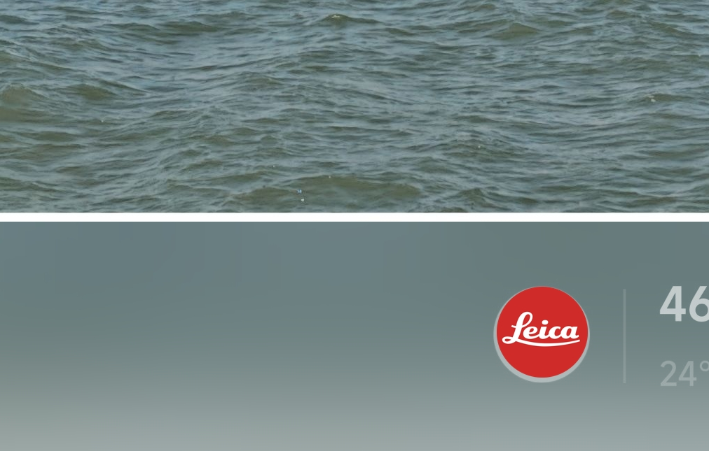

# 小米-徕卡水印 高斯模糊效果

最近爱上蓝厂的模糊水印了，感觉比粮厂的纯色自然多了。酷安找了一圈没人做，谷歌相机又只能直出，不能编辑。那我就自己简单搓一个吧。

## 📘先放样张：

### 小米相册


### ちん佬谷歌相机


#### 程序做得非常简单，目前仅为能用状态，甚至没有UI，限制也挺多。所有功能确实都能通过 Photoshop 解决，不过如果你用好了可以节省很多p图时间。

## 🍚食用方法：
### 1. [Github Releases](https://github.com/MrBocchi/LeicaBlurMark/releases)

仅 Windows 平台，完整解压后，把图片放入 input 文件夹，双击运行 `点我执行.bat` 即可。

### 2. Python

下载并安装 Python。然后安装 `pillow` 库：

```py
pip install pillow
```
双击运行 `点我执行.bat` 。

## ⚠️注意事项（每一条都很重要）：

#### 1. 图片需要预先处理，在小米相册编辑里加上徕卡的水印。ちん佬的谷歌相机徕卡水印也支持。

#### 2. 放入的图片尽量为原图，网上下载的图片多少都会有压缩，大概率会造成位置识别不准确。

#### 3. 只支持小米徕卡的 `白色` `底部` 水印。黑色红色不行，一圈的右边的也不行。

#### 4. 输出图片的照片与水印边界处出现白边时、以及红色徕卡logo出现白边时（见下图），打开 config.ini 自行编辑参数。


#### 5. 程序几乎做没有图片检测，只要是 jpg 就会被处理，处理前请自行人工查看是否符合 `注意事项123` 内的要求。

#### 6. 选择开启 `红色徕卡Logo` 后的图片生成成功率会降低，非原图不推荐开启。

#### 7. 如果符合上述条件但依旧报错 `未能定位到徕卡Logo`，打开 `config.ini`，使用ps取色你的logo的颜色，替换里面的 `leica_color_1或2或3`。（不要新增4，不会读取）

## 🖊️总结：

欢迎大佬来优化，无论是加个GUI还是重新写一个完整的程序。

Leica 标志及商标为徕卡相机有限公司的注册商标，归该公司所有。Xiaomi 标志及商标是小米科技有限责任公司的注册商标，归该公司所有。